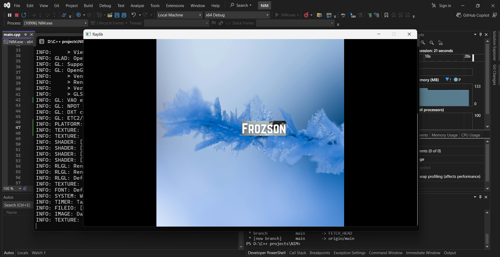

# NIM

A Image Processing Module that uses CNN and other possibly useful AI to implement various features.

## Warning

It is still in Eary Development , so please notice on any issues and who want to experiment on it are please be mindful of what you are doing.

## Open for Contributors

As this is a project taken by me alone, I possibly need your help for making this full functional module.
So those who want to contribute are requested to put up your work then we discuss and stage the merge.
